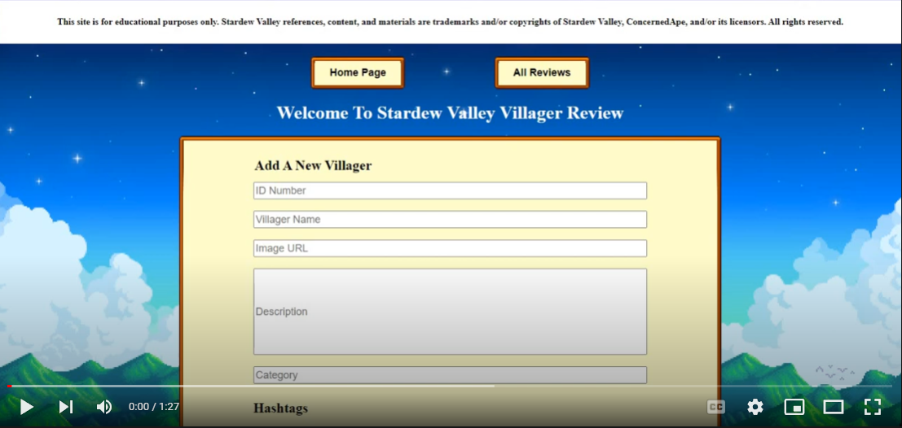

# Reviews Site

<div id="top"></div>

- <a href="#lang">Languages & Tech</a>
- <a href="#about">About</a>
- <a href="#demo">Demo</a>
- <a href="#notes">Notes</a>
- <a href="#resources">Resources</a>
- <a href="#contact">Contact</a>

<div id ="lang">

## Languages & Technologies

- Java
- HTML / CSS
- Spring
- Thymeleaf

<!-- About -->
<div id ="about">

## About

This review site is an exercise in Spring JPA + MVC framework.

<p align="right">(<a href="#top">BACK TO TOP</a>)</p>

<div id ="demo">

## Demo & Screenshots

### Click To Play

<a href="https://youtu.be/WiNTFBfGXio" target="_blank"></a>

## Checklists

Review Site - Stretch Goals
- [x] Create Review submission form
- [x] Delete data
- [ ] Edit data
- [x] Implement Hashtags
- [ ] Addable Hashtags to Review creation
- [ ] Add Hashtags to existing review
- [ ] Star Rating system
- [ ] Pagination buttons

<p align="right">(<a href="#top">BACK TO TOP</a>)</p>

<div id ="notes">

## Notes

I'm struggling with how to assign multiple tags at once as well as add on additional tags to an existing review.
Based on Jordan's JPA demo using topics, posts, and hashtags, all the methods and ways of getting the tests to pass should work.
I've tried dozens of different ways (far beyond what is shown in the tests) and none have passed.

I've tried creating an entirely new Review by passing all parameters + the new list of hashtags 
(which based on the tutorials I've watched is what I think that ends up ultimately happening) but that hasn't worked either.

In fact, from what I watched and from looking at Jordan's demo code, Hashtags aren't even present in the (controller) constructor,
so I'm not even sure of how they're being appended to the Review (except via 'addPost' method in the Post class, which I've done).

```
// Jordan's Code:

    @PostMapping("/addHashtag")
    public String addHashtag(@RequestParam String newHashtag, @RequestParam String postId){
        Hashtag hashtagToSave = new Hashtag(newHashtag);
        hashRepo.save(hashtagToSave);
        long id = Long.parseLong(postId);
        Post post = postRepo.findById(id).get();
        post.addHashtag(hashtagToSave);
        postRepo.save(post);
        return "redirect:/posts/" + postId;
    }
```

My thought is maybe  this is something CRUD related that is automatically handled in the interface.
The tutorials I watched showed there were conjoined tables within the Repository that held this data - review_hashtags.

Or maybe there's something completely simple that I'm overlooking. 
And right now, I feel the latter is probably the case :sweat_smile:

**Things To Research:**


## Even More Notes

To be continued...

**Thoughts On The Project**

**What I learned**

Syntax is important, and I don't like error codes.

<p align="right">(<a href="#top">BACK TO TOP</a>)</p>

<div id="resources">

## Credits & Resources Used

<a href="https://stardewvalley.net/">Stardew Valley</a>
<br>
<a href="https://stardewvalleywiki.com/">Stardew Valley Wiki</a>

<div id="contact"></div>

## Contact

Email: <a href="mailto:noellegisewhite@gmail.com">Noellegisewhite@gmail.com</a>
<br>LinkedIn: <a href="https://www.linkedin.com/in/noellegisewhite/"> Noelle Gisewhite</a>